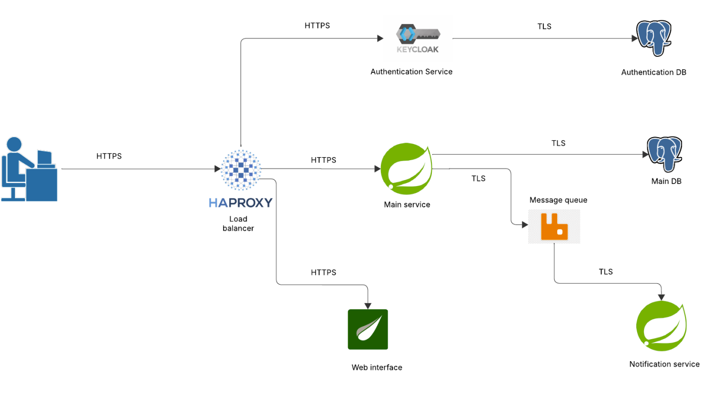

# MediBook

Projekt systemu rezerwacji wizyt u lekarza. Przygotowany na kurs *Analiza i ocena bezpieczeństwa systemów usługowych i internetu rzeczy (IoT)*, prowadzonego przez dra inż. Łukasza Falasa, w ramach toku studiów magisterskich na Politechnice Wrocławskiej, semestr letni 2025.

## Autorzy
Kacper Wieczorek - backend

Przemysław Kojs - frontend

## Zdefiniowani użytkownicy:

### Gość
- Zalogowanie się
- Założenie konta

### Klient
- Przeglądanie dostępnych lekarzy i specjalizacji
- Przeglądanie terminów wizyt
- Rezerwacja wizyty
- Anulowanie wyzyty
- Zmiania terminu wizyty
- Przeglądanie historii wizyt
- Otrzymywanie przypomnień o nadchodzących wizytach
- Otrzymywanie informacji o zmianach w statusie wizyt

### Lekarz
- Edycja profilu i specjalizacji
- Przeglądanie listy umówionych wizyt
- Edycja dostępnych terminów
- Akceptowanie i anulowanie wizyt
- Otrzymywanie przypomnień o nadchodzących wizytach
- Otrzymywanie powiadomień o rezerwacjach wizyt

### Administrator
- Zarządzanie specjalizacjami
- Zarządzanie użytkownikami

## Wymagania dot. bezpieczeństwa
- Połączenie między użytkownikiem końcowym a systemem będzie realizowane za pomocą protokołu **HTTPS**
- Połączenia między serwisami będą zabezpieczone za pomocą protokołu **TLS**
- Autentykacja podczas komunikacji za pomocą kolejki komunikatów będzie odbywać się przy wykorzystaniu certyfikatów **x.509**
- Autentykacja 2-składnikowa
- Ograniczenie liczby żądań dla uwierzytelniania
- Komunikacja z REST API z użyciem tokenów JWT

## Architektura systemu

### Stos technologiczny
**Backend**: Java + spring boot\
**Frontend**: Thymeleaf + HTMX\
**Baza danych**: Postgresql\
**Bezpieczeństwo**: Spring Security + Keycloak\
**Komunikacja**: REST API + RabbitMQ\
**Wdrożenie**: Docker\
**Kontrola wersji**: Github\
**CI/CD**: Github Actions